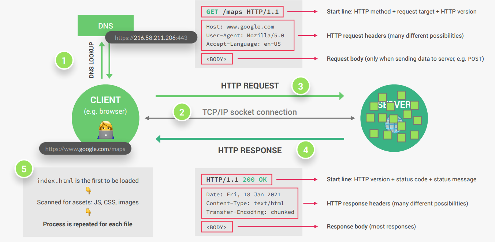
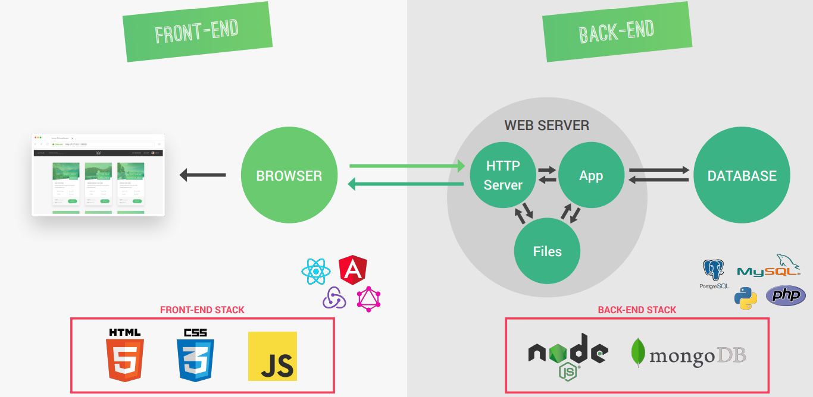
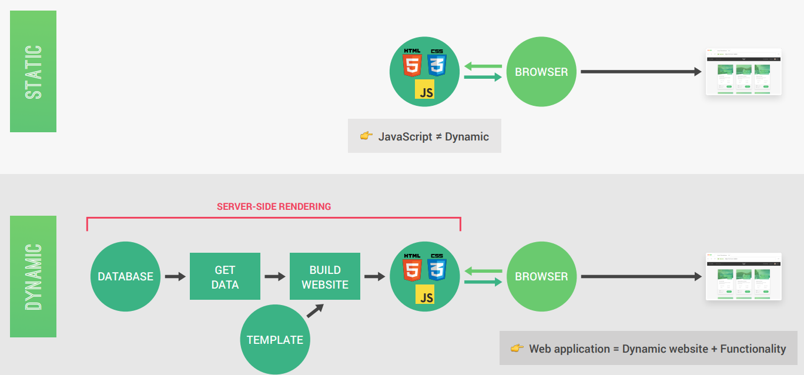
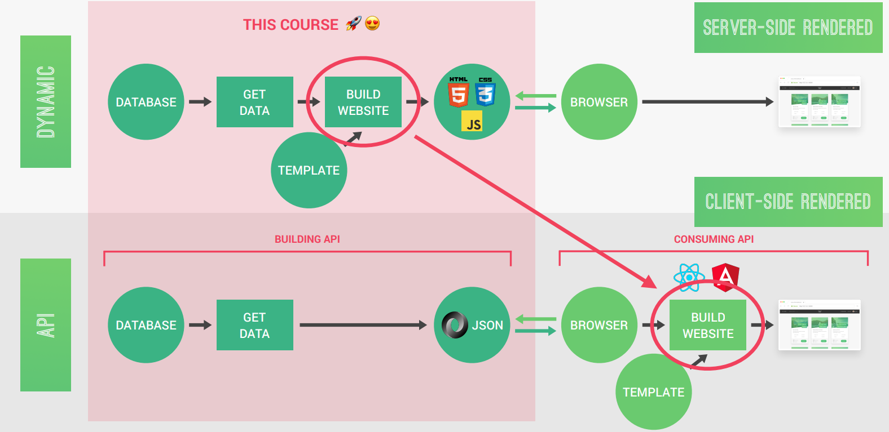
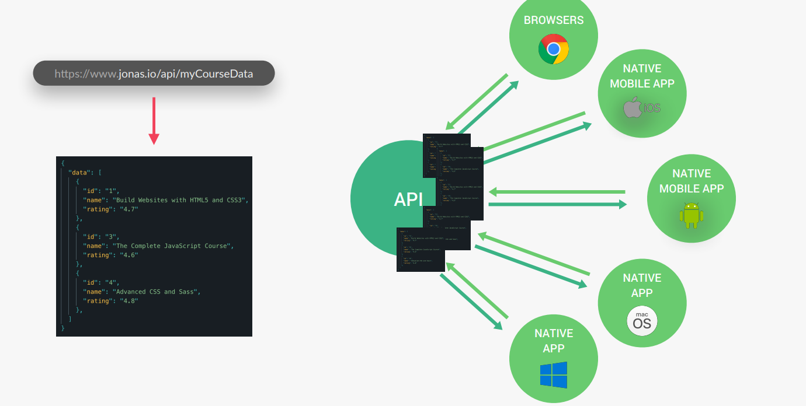

# Introduction to Backend Development

## What happens when we access a webpage

## Front-end and Back-end development

## Static vs. Dynamic websites
1. **Static Websites**:
    - Content is fixed and does not change unless the developer manually updates the code.
    - Built using HTML, CSS, and sometimes JavaScript.
    - No server-side processing; content is the same for all users.
    - Examples: Portfolio websites, documentation pages.

2. **Dynamic Websites**:
- Content is generated dynamically based on user interactions or data from a database.
- Built using server-side technologies like Node.js, PHP, or Python, along with front-end frameworks.
- Content can vary for different users or at different times.
- Examples: Social media platforms, e-commerce websites.

## Dynamic vs. API-Powered websites
1. **Dynamic Websites**:
- Content is generated dynamically based on user interactions or data from a database.
- Built using server-side technologies like Node.js, PHP, or Python, along with front-end frameworks.
- Content can vary for different users or at different times.
- Examples: Social media platforms, e-commerce websites.

2. **API-Powered Websites**:
    - Content is fetched from external APIs (Application Programming Interfaces) rather than being generated entirely on the server.
    - Often use front-end frameworks (e.g., React, Angular) to consume APIs and render content dynamically.
    - Examples: Weather apps, news aggregators, or apps using third-party services like Google Maps.

## One API, Many Consumers

## Server-Side Rendered (SSR) vs. Client-Side Rendered (CSR) Websites

## Server-Side Rendered (SSR) Websites
- The server generates the complete HTML for a webpage and sends it to the browser.
- The browser displays the content immediately after receiving the HTML.
- Suitable for SEO (Search Engine Optimization) as search engines can easily crawl the content.
- Examples: Traditional websites, blogs, news sites.
- **Technologies**: PHP, Ruby on Rails, or frameworks like Next.js (for React).

## Client-Side Rendered (CSR) Websites
- The server sends a minimal HTML file and JavaScript to the browser.
- The browser executes the JavaScript to dynamically generate and render the content.
- Content rendering happens on the client-side (browser), which may cause slower initial load times.
- Suitable for highly interactive applications but less SEO-friendly unless additional techniques (e.g., pre-rendering) are used.
- Examples: Single Page Applications (SPAs) like Gmail, Facebook.
- **Technologies**: React, Angular, Vue.js.

## Key Differences

| Feature                | Server-Side Rendering (SSR)         | Client-Side Rendering (CSR)         |
|------------------------|-------------------------------------|-------------------------------------|
| **Rendering Location** | On the server                      | In the browser (client-side)       |
| **Initial Load Speed** | Faster (HTML is pre-rendered)       | Slower (JavaScript needs to execute)|
| **SEO**                | Better (content is readily available)| Requires additional techniques     |
| **Interactivity**      | Limited interactivity              | Highly interactive                 |
| **Technologies**       | PHP, Ruby on Rails, Next.js         | React, Angular, Vue.js             |
| **Examples**           | Blogs, news sites                  | Gmail, Facebook                    |
