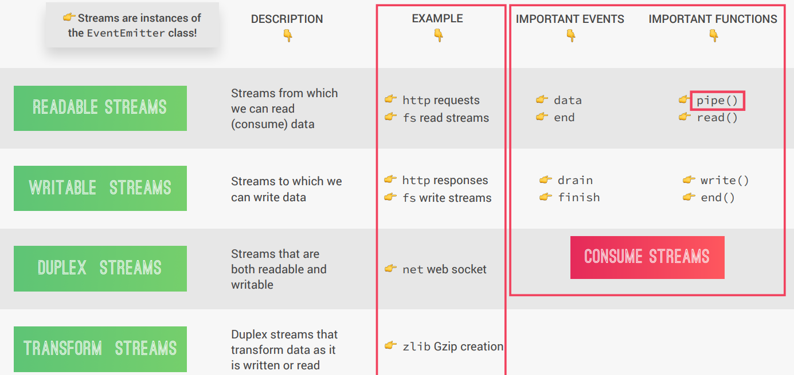

# Streams
- Streams are used to process (read and write) data piece by piece (chunks), without completing the whole read or write operation, and therefore without keeping all the data in memory.
- Perfect for handling large volumes of data, for example: videos.
- More efficient data processing in terms of memory (no need to keep all data in memory) and time (we don't have to wait until all the data is available).
- The `http` request (`req` - Generally used name in programs for http requests) is a **readable stream** whereas the `http` response (`res` - Generally used name in programs for http responses) **writable stream**.

### Types of Streams


### Backpressure problem
- **Backpressure** occurs when the **readable stream** (file) produces data faster than the **writable stream** (HTTP response) can consume it. This can overwhelm the writable stream, leading to performance degradation or even crashing the server.
- The `solution 02` of the file [streams.js](./streams.js) might show the backpressure problem.

#### Why Backpressure happens
1. **Readable Stream**:
    - The `fs.createReadStream` reads chunks of data from the file.
    - It emits `'data'` events as soon as chunks are available.
2. **Writable Stream**:
    - The `res.write` method writes chunks to the HTTP response.
    - If the writable stream (HTTP response) can't process the chunks as fast as they are being read, the internal buffer of the writable stream fills up.
3. **Result**:
    - When the writable stream's buffer is full, it signals backpressure, but the current code does not handle it.
    - This can lead to memory issues or even crash the server if the buffer overflows.

#### Solution: Use `pipe()` to Handle Backpressure
- The `pipe()` method automatically manages the flow of data between the readable and writable streams, preventing backpressure issues.
- The `pipe()` method listens for the drain event on the writable stream and pauses the readable stream when the writable stream's buffer is full.
- It resumes the readable stream when the writable stream is ready to accept more data.
- This ensures that data flows smoothly without overwhelming the writable stream.
- The `solution 03` of the file [streams.js](./streams.js) is the solution for the backpressure problem. This solution follows this syntax:
```javascript
readableSource.pipe(writableDest)
```

## Important events and functions for readable stream

### Events in Readable Streams

1. **`data` Event**:
    - Emitted when a chunk of data is available to be read from the stream.
    - Used to process data as it is being read.
    - Example:
      ```javascript
      readable.on('data', (chunk) => {
        console.log(`Received chunk: ${chunk}`);
      });
      ```

2. **`end` Event**:
    - Emitted when there is no more data to be read from the stream.
    - Indicates that the stream has finished reading.
    - Example:
      ```javascript
      readable.on('end', () => {
        console.log('No more data to read.');
      });
      ```

3. **`error` Event**:
    - Emitted when an error occurs while reading the stream.
    - Example:
      ```javascript
      readable.on('error', (err) => {
        console.error('Error occurred:', err);
      });
      ```
---

### Functions in Readable Streams

1. **`pipe()`**:
    - Automatically manages the flow of data between a readable stream and a writable stream.
    - Handles **backpressure** by pausing the readable stream when the writable stream's buffer is full and resuming it when the buffer is ready.
    - Syntax:
      ```javascript
      readable.pipe(writable);
      ```
    - Example:
      ```javascript
      const readable = fs.createReadStream('./file.txt');
      const writable = fs.createWriteStream('./output.txt');
      readable.pipe(writable);
      ```

2. **`read()`**:
    - Used to manually read data from the stream in chunks.
    - Returns a chunk of data or `null` if no data is available.
    - Example:
      ```javascript
      const chunk = readable.read();
      console.log(`Read chunk: ${chunk}`);
      ```
---

### Summary
- **Events** like `data` and `end` allow you to handle data as it is read or when the stream finishes.
- **Functions** like `pipe()` simplify data flow between streams, while `read()` provides manual control over reading data.

## Important events and functions for readable stream

### Events in Writable Streams

1. **`drain` Event**:
    - Emitted when the writable stream's internal buffer is emptied and it is ready to accept more data.
    - Useful for managing backpressure when writing large amounts of data.
    - Example:
      ```javascript
      writable.on('drain', () => {
        console.log('Buffer drained, ready for more data.');
      });
      ```

2. **`finish` Event**:
    - Emitted when the `end()` method is called, and all data has been flushed to the writable stream.
    - Indicates that the writable stream has finished writing.
    - Example:
      ```javascript
      writable.on('finish', () => {
        console.log('All data written to the stream.');
      });
      ```

---

## Functions in Writable Streams

1. **`write()`**:
    - Writes data to the writable stream.
    - Returns `true` if the data was written successfully, or `false` if the internal buffer is full (indicating backpressure).
    - Example:
      ```javascript
      const success = writable.write('Hello, World!');
      if (!success) {
        console.log('Backpressure detected, waiting for drain event.');
      }
      ```

2. **`end()`**:
    - Signals that no more data will be written to the stream.
    - Optionally, you can pass a final chunk of data to be written before the stream ends.
    - Example:
      ```javascript
      writable.end('Goodbye, World!', () => {
        console.log('Stream ended.');
      });
      ```
---

## Summary
- **Events** like `drain` help manage backpressure, while `finish` indicates that all data has been written to the stream.
- **Functions** like `write()` allow you to send data to the writable stream, and `end()` signals the end of the writing process.
