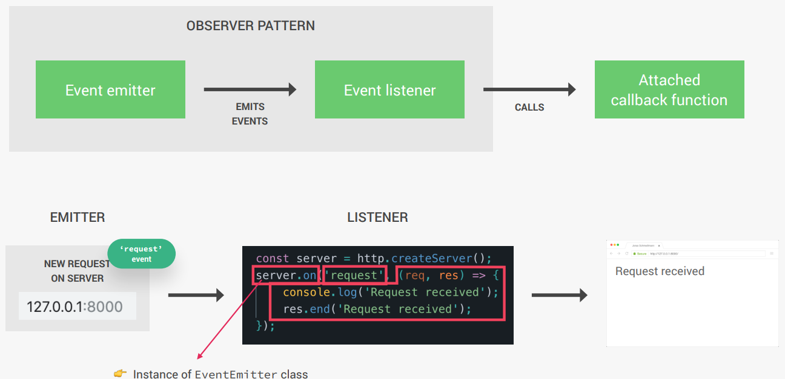
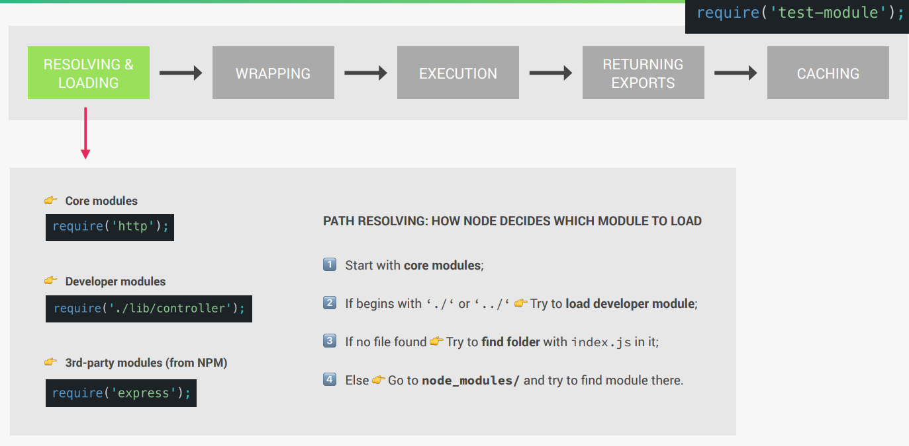
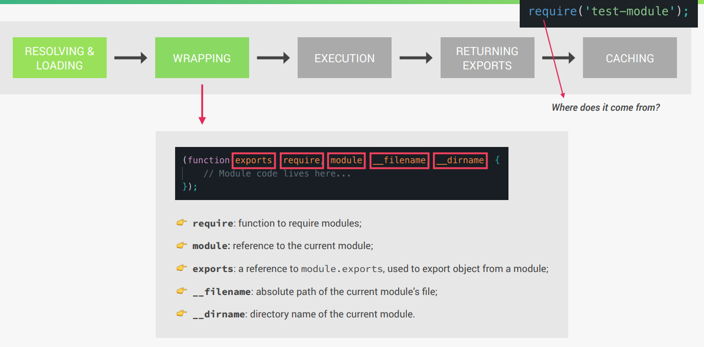
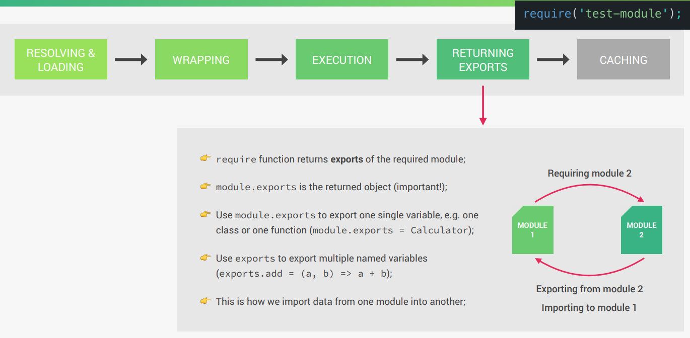

# How NodeJS works

## The Architecture of NodeJS


## Node Process and Threads


## Thread Pool
In Node.js, the **Thread Pool** is part of the `libuv` library, which provides a pool of threads to handle expensive or blocking operations, such as cryptographic functions, file system operations, or DNS lookups. By default, the thread pool has 4 threads.

### Key Points:
1. **Thread Pool Size**:
    - By default, the thread pool size is 4. You can change it by setting the `UV_THREADPOOL_SIZE` environment variable (e.g., `process.env.UV_THREADPOOL_SIZE = 8`).
2. Concurrency:
    - The thread pool allows up to 4 tasks to run concurrently. Additional tasks are queued until a thread becomes available.
3. Blocking Operations:
    - CPU-intensive tasks like `crypto.pbkdf2` can block the thread pool if there are too many concurrent tasks, potentially delaying other operations.

## Event-Driven Architecture


## The CommonJS Module System
- Each JavaScript file is treated as a separate module.
- NodeJS uses the CommonJS module system: `require()`, exports or, `module.exports`.
- ES module system is used in browsers: `import/export`.
- There have been attempts to bring ES modules to NodeJS (with `.mjs` extension).
- The `require` comes from where in `require('test-module')`.

### How requiring modules really works




### Example
```javascript
console.log(arguments);
console.log(require('module').wrapper);
```
#### 1. `arguments`
- In NodeJS, every module is wrapped in a function by the module system. This function provides the module with some special arguments like `exports`, `require`, `module`, `__filename` and `__dirname`.
- When you log `arguments`, it prints the arguments passed to this wrapper function.

#### 2. `require('module').wrapper`
- This prints the actual wrapper function used by NodeJS to wrap every module.
- The wrapper function looks like this:
```
'(function (exports, require, module, __filename, __dirname) { ... })'
```

### Module Caching
- In Node.js, module caching refers to the mechanism where a module is loaded and executed only once, and subsequent `require` calls return the same cached instance of the module.
- This improves performance by avoiding redundant loading and execution of the same module multiple times.
- Example:
```javascript
require('./src/basic-module')();
require('./src/basic-module')();
```
When the first `require('./src/basic-module')` is executed:
1. Node.js loads the module file `basic-module.js`, executes its code and caches the exported value.
2. The result of this module's execution is stored in the `require.cache` object.

When the second `require('./src/basic-module')` is executed:
1. Instead of reloading and re-executing the module, Node.js retrieves the cached version from `require.cache`.
2. This means the module's code is not executed again, but the same exported value is reused.

This behavior is why it's called **caching**. If the module has side effects (e.g., logging or modifying global variables), those side effects will only occur during the first require call.

To observe this behavior, you can see a `console.log` in the `basic-module.js`. Even though require is called twice, it logs only once.
