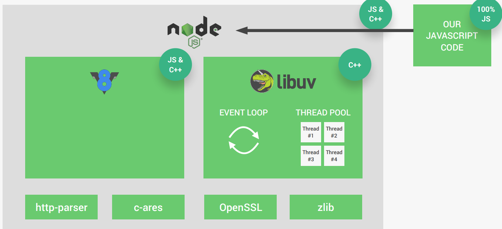
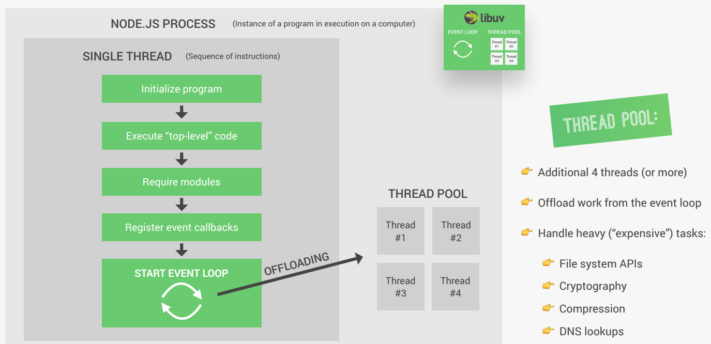
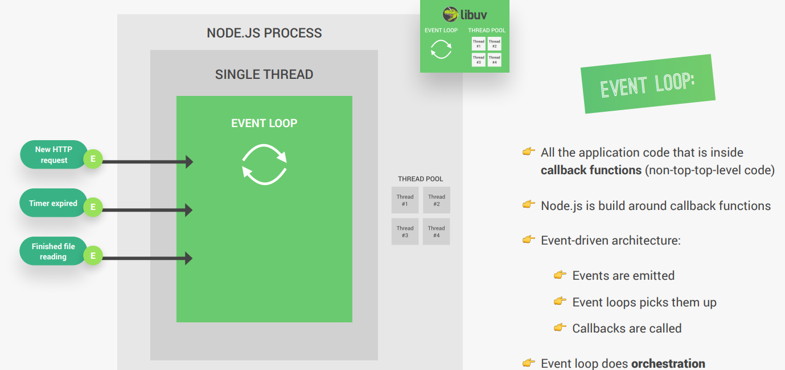
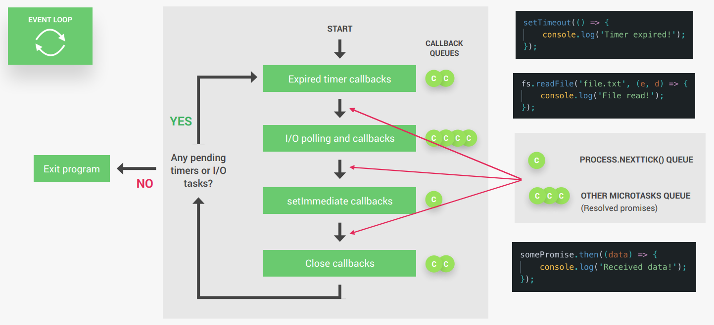
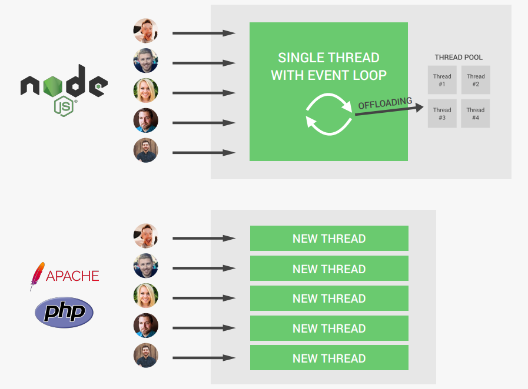

# How NodeJS works

## The Architecture of NodeJS


## Node Process and Threads


## Event Loop in Node.js
The **Event Loop** is a core mechanism in Node.js that allows it to handle multiple operations (like I/O tasks, timers, and user requests) efficiently on a **single thread**. It is the backbone of Node.js's **non-blocking**, **asynchronous architecture**.

### How the Event Loop works
1. **Single Thread**: 
Node.js runs on a single thread, but it can handle many tasks concurrently using the Event Loop.
2. **Phase of the Event Loop**:
The Event Loop has several phases, and each phase handles specific types of operations. These phases are executed in a loop, ensuring that all tasks are processed. The main phases are:
    - **Timers**: Executes callback for `setTimeout()` and  `setInterval()`.
    - **Pending Callbacks**: Executes I/O callbacks that were deferred (e.g., errors from file operations).
    - **Idle, Prepare**: Internal use only.
    - **Poll**: Retrieves new I/O events and executes their callbacks (e.g., reading files, network requests).
    - **Check**: Executes callback for `setImmediate()`.
    - **Close Callbacks**: Executes callback for closed resources (e.g., `socket.on('close')`).
3. **Callback Queue**:
    - When an asynchronous operation (like reading a file) is initiated, Node.js delegates the task to the system (e.g., the file system or network).
    - Once the operation is complete, its callback is added to the appropriate queue.
    - The Event Loop picks up these callbacks and executes them in the correct phase.
4. **Non-blocking Nature**:
    - While waiting for I/O operations to complete, the Event Loop continues to process other tasks, ensuring that the main thread is never blocked.





### Example: Understanding the Event Loop
```javascript
console.log('Start');

setTimeout(() => {
  console.log('Timeout callback');
}, 0);

Promise.resolve().then(() => {
  console.log('Promise callback');
});

console.log('End');
```

### Output:
```
Start
End
Promise callback
Timeout callback
```

### Explanation:
1. **Synchronous Code**: 
    - The `console.log('Start')` and `console.log('End')` are synchronous operations, so they are executed immediately in the **main thread**.
2. **setTimeout**:
    - The `setTimeout` callback is registered in the **Timers phase** of the Event Loop.
    - Even though the timeout is `0ms`, the callback is not executed immediately. It is added to the **callback queue** and will only be executed after the synchronous code and microtasks (like Promises) are completed.
3. **Promise**:
    - The `Promise.resolve().then()` is a **microtask**. Microtasks are executed before moving to the next phase of the Event Loop, so it runs after the synchronous code but before the `setTimeout` callback.
4. **Event Loop Execution**:
    - The Event Loop processes the synchronous code first (`Start` and `End`).
    - Then, it processes the **microtasks** (Promise callback).
    - Finally, it processes the **Timers phase**, executing the `setTimeout` callback.

### Key Takeaways:
- Synchronous code is executed first.
- Microtasks (like Promises) are executed before moving to the next Event Loop phase.
- Asynchronous callbacks (like `setTimeout`) are executed in their respective Event Loop phases.

## Summary of the Event Loop: Node vs Others
It is the developer's responsibility not to block the main thread in Node.js. By using asynchronous operations and callbacks, you can ensure that the Event Loop continues to process tasks efficiently.

Make sure to avoid the following tasks:
- Don’t use sync versions of functions in `fs`, `crypto` and `zlib` modules in your callback functions
- Don’t perform complex calculations (e.g. loops inside loops)
- Be careful with JSON in large objects
- Don’t use too complex regular expressions (e.g. nested quantifiers)



## Event loop

