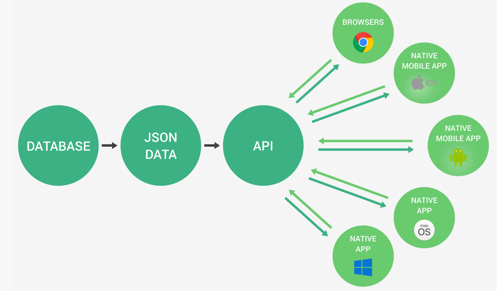
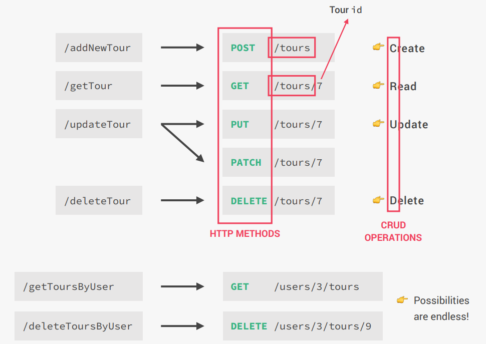
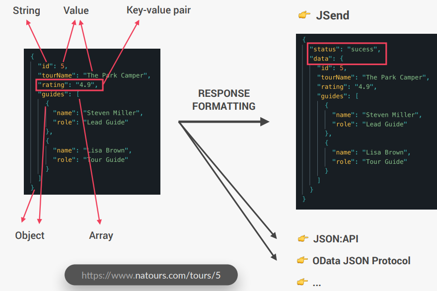
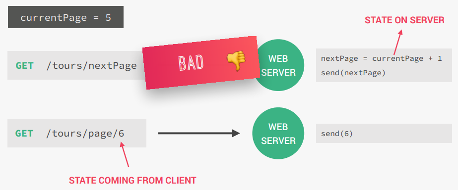
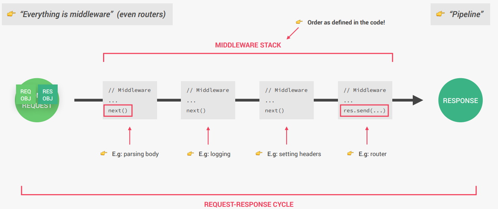

# Express

## What is Express and Why Use it?
- Express is a minimal Node.js framework, a higher level of abstraction.
- Express contains a very robust set of features: 
    - Complex routing
    - Easier handling of requests and responses
    - Middleware
    - Server-side rendering, etc.
- Express allows for rapid development of Node.js applications: we dont't have to reindex the wheel.
- Express makes it easier to organize our application into the MVC architecture.

## API
- API stands for **A**pplication **P**rogramming **I**nterface.
- A piece of software that can be used by another piece of software, in order to allow applications to talk to each other.
- A very commonly used term is `CRUD` (Create, READ, Update, Delete).
- But, "Application" can be other things:
    - Node.js or, `http` APIs ("node APIs")
    - Browser's DOM JavaScript API
    - With object-oriented programming, when exposing methods to the public, we're creating an API.



## The REST Architecture
The REST architecture is a way of building web APIs in a logical way, making them easy to consume and understand.

Following is the REST architecture:
1. Separate API into logical resources
2. Expose structured, resource-based URLs
3. Use HTTP methods (verbs)
4. Send data as JSON (usually)
5. Be Stateless

### 1. Separate API into logical resources
- **Resources**: Object or representation of something, which has data associated to it. Any information that can be **named** can be a resource.
- Ex.: `tours`, `users`, and `reviews`
- Resources represent objects or entities in the system, such as `users`, `tours`, or `reviews`. Each resource should have its own endpoint, making the API easier to understand and maintain.
- Suppose an URL like `https://natours.com/addNewTour` where `addNewTour` is the endpoint. Instead of `addNewTour`, the endpoint could be `/getTour`, `/updateTour`, `/getToursByUser` and `/deleteTourByUser`. So this is a bad naming convention for endpoints.
- Endpoints should contain **only resources** (nouns), and use **HTTP methods** for actions.

### 2. **Expose Structured, Resource-Based URLs**  
- Use clear and consistent URLs that represent resources (nouns) rather than actions (verbs). For example, use `/tours` instead of `/addNewTour`.

### 3. **Use HTTP Methods (Verbs)**  
Leverage HTTP methods to define actions on resources:
- `GET` for retrieving data
- `POST` for creating new resources
- `PUT` or `PATCH` for updating resources
- `DELETE` for removing resources



### 4. **Send Data as JSON (Usually)**  
- JSON is the most commonly used format for data exchange in REST APIs due to its simplicity and compatibility with most programming languages.
- In JSON, the key value must be enclosed within double quotes.



### 5. **Be Stateless**  
- **Stateless RESTful API**: All state is handled on the client. This means that each request must contain all the information necessary to process a certain request. 
- The server does not store any client-specific state between requests, ensuring scalability and simplicity.
- Example of state: `loggedIn`, `currentPage`



## HTTP Methods

HTTP methods define the type of action to be performed on a resource in a RESTful API. Common methods include:

1. **GET**  
   Used to retrieve data from the server. It is a read-only operation and does not modify the resource.

2. **POST**  
   Used to create a new resource on the server. The request body typically contains the data for the new resource.

3. **PUT**  
   Used to update an existing resource or create it if it does not exist. It replaces the entire resource.

4. **PATCH**  
   Used to partially update an existing resource. It modifies only the specified fields.

5. **DELETE**  
   Used to delete a resource from the server.

These methods align with CRUD operations:  
- **Create** → `POST`  
- **Read** → `GET`  
- **Update** → `PUT`/`PATCH`  
- **Delete** → `DELETE`

## PUT vs PATCH

Both `PUT` and `PATCH` are HTTP methods used to update resources, but they differ in how they handle updates:

1. **PUT**  
   - Used to **replace** an entire resource.
   - If the resource exists, it is completely overwritten with the new data.
   - If the resource does not exist, it can create a new one (depending on the implementation).
   - Example:  
    Sending a `PUT` request with `{ "name": "Tour A", "price": 100 }` will replace the entire resource with only these fields.

2. **PATCH**  
   - Used to **partially update** a resource.
   - Only the specified fields in the request are updated, leaving the rest of the resource unchanged.
   - Example:  
    Sending a `PATCH` request with `{ "price": 100 }` will update only the `price` field, leaving other fields like `name` intact.

### Key Difference
- **PUT**: Full replacement of the resource.
- **PATCH**: Partial modification of the resource.

## Middleware
Middleware in Express is a function that executes during the lifecycle of a request to the server. It has access to the `req` (request), `res` (response), and `next` objects. Middleware functions can:

1. Execute any code.
2. Modify the `req` and `res` objects.
3. End the request-response cycle.
4. Call the `next()` function to pass control to the next middleware in the stack.

### Types of Middleware
1. **Built-in Middleware**: Provided by Express, e.g., `express.json()` for parsing JSON.
2. **Third-party Middleware**: Installed via `npm`, e.g., `morgan` for logging.
3. **Custom Middleware**: User-defined functions for specific tasks.

### Example
```javascript
app.use((req, res, next) => {
  console.log('Middleware executed!');
  next(); // Pass control to the next middleware
});
```

### The Essence of Express Development: The Request-Response Cycle
The **request-response cycle** is the process by which a client sends a request to a server, and the server processes the request and sends back a response. This cycle is fundamental to how web applications work.

1. **Client Sends a Request**  
   - The client (e.g., browser, Postman, or another application) sends an HTTP request to the server.  
   - The request contains details like the HTTP method (`GET`, `POST`, etc.), URL, headers, and optionally a body.

2. **Server Receives the Request**  
   - The server receives the request and processes it.  
   - Middleware functions in Express can intercept and modify the request or perform specific tasks (e.g., logging, authentication).

3. **Route Handling**  
   - The server matches the request to a specific route and executes the corresponding route handler.  
   - The route handler processes the request and prepares a response.

4. **Server Sends a Response**  
   - The server sends an HTTP response back to the client.  
   - The response contains a status code (e.g., `200 OK`, `404 Not Found`), headers, and optionally a body (e.g., JSON data).

5. **Client Receives the Response**  
   - The client receives the response and processes it (e.g., rendering data on a webpage or displaying it in a tool like Postman).



### Example in Express
```javascript
app.get('/api/v1/tours', (req, res) => {
   res.status(200).json({
      status: 'success',
      data: { tours: [] },
   });
});
```

### Does the Order of Middleware Matter in Express?

Yes, the **order of middleware** in Express matters a lot. Middleware functions are executed in the order they are defined in the code. If a middleware is placed before or after a specific route or another middleware, it can affect how the request is processed.

### Key Points:
1. **Global Middleware**: Middleware defined using `app.use()` is applied to all routes and is executed in the order it appears in the code.
2. **Route-Specific Middleware**: Middleware can be applied to specific routes, and its position relative to other middleware or routes determines its execution.
3. **`next()` Function**: Middleware must call `next()` to pass control to the next middleware or route handler. If `next()` is not called, the request-response cycle will be terminated.

### Example:
```javascript
app.use((req, res, next) => {
  console.log('Middleware 1');
  next();
});

app.get('/', (req, res) => {
  console.log('Route Handler');
  res.send('Hello World');
});

app.use((req, res, next) => {
  console.log('Middleware 2');
  next();
});
```
In this example:
- **"Middleware 1"** will execute before the route handler.
- **"Middleware 2"** will not execute for the `/` route because it is defined after the route handler.

### Conclusion:
The order of middleware determines the flow of the request-response cycle. Always define middleware in the correct sequence to ensure proper functionality. 

## Param Middleware
In Express, **param middleware** is a special type of middleware that is triggered whenever a specific route parameter is present in the route. It is used to handle logic related to route parameters, such as validating, transforming, or logging the parameter before the request reaches the route handler.

### How it works:
- The `router.param()` method is used to define param middleware.
- It takes two arguments:
   1. The name of the route parameter (e.g., `'id'`).
   2. A callback function that is executed whenever the specified parameter is present in the route.

### Syntax
```javascript
router.param(paramName, callback);
```

### Callback Function
The callback function has the following signature:
```javascript
(req, res, next, value) => { ... }
```
- `req`: The request object.
- `res`: The response object.
- `next`: A function to pass control to the next middleware.
- `value`: The value of the parameter in the route.

### Example
```javascript
router.param('id', (req, res, next, val) => {
  console.log(`Tour id is ${val}`);
  next();
});
```
- This middleware is triggered whenever a route contains the `:id` parameter (e.g., `/tours/:id`).
- It logs the value of the `id` parameter (val) to the console.
- After executing its logic, it calls `next()` to pass control to the next middleware or route handler.

### Use Cases:
1. **Validation**: Check if the parameter is valid (e.g., ensure `id` is a valid number or UUID).
2. **Transformation**: Modify the parameter value (e.g., convert a string to a number).
3. **Logging**: Log the parameter value for debugging or analytics.

### Example With Validation
```javascript
router.param('id', (req, res, next, val) => {
   if (!/^\d+$/.test(val)) {
      return res.status(400).send('Invalid ID');
   }
   next();
});
```
This ensures that the `id` parameter is a valid number before proceeding to the route handler.

## Chaining Multiple Middleware Functions
In Express, you can chain multiple middleware functions for a single route. Each middleware function performs a specific task and passes control to the next middleware using the `next()` function. If a middleware sends a response, it terminates the request-response cycle, and subsequent middleware functions are not executed.

### Syntax
```javascript
router.post(checkBody, createTour);
```

### Explanation
1. **Middleware Order**:
   - For the `POST /` route, the `checkBody` middleware runs first.
   - If `checkBody` calls `next()`, the `createTour` controller is executed.
   - If `checkBody` sends a response (e.g., validation fails), the request-response cycle ends, and `createTour` is not executed.
2. **Example `checkBody` Middleware**: You can implement the checkBody middleware in tourController.js to validate the request body before creating a new tour:
```javascript
exports.checkBody = (req, res, next) => {
   if (!req.body.name || !req.body.price) {
      return res.status(400).json({
         status: 'fail',
         message: 'Missing name or price',
      });
   }
   next();
};
```
3. **How It Works**
- When a `POST /` request is made, `checkBody` ensures that the request body contains name and price.
- If the validation passes, `next()` is called, and the `createTour` controller handles the request.
- If validation fails, a `400 Bad Request` response is sent, and `createTour` is not executed.

This approach ensures modular and reusable middleware functions, improving code readability and maintainability.

## Environment Variables (NodeJS)
### `app.get('env')` (Set by Express)
- `app.get('env')` is a built-in method in Express that returns the value of the `NODE_ENV` environment variable.
- If `NODE_ENV` is not explicitly set, it defaults to `'development'`.

### Common Values for `NODE_ENV`
1. **`development`**: Default mode, used during development.
2. **`production`**: Used in production environments for optimized performance.
3. **`test`**: Used during testing.

### `process.env` (Set by NodeJS)
`process.env` is a global object in Node.js that provides access to the environment variables of the current process. It allows you to read or set environment-specific configurations, such as API keys, database credentials, or runtime settings.

#### Key Points:
1. **Access Environment Variables**:  
   You can access environment variables using `process.env.VARIABLE_NAME`.  
   Example:
   ```javascript
   console.log(process.env.NODE_ENV); // Logs the value of NODE_ENV
   ```
2. **Set Environment Variables**:  
   Environment variables can be set in the terminal before running the Node.js application.
   
   ##### Example 
   - **Windows**:
   ```bash
   set PORT=4000 && node app.js
   ```

   - **Linux / Mac**:
   ```bash
   PORT=4000 node app.js
   ```
3. **Default Values**:
   You can provide default values if an environment variable is not set.
   
   Example:
   ```javascript
   const port = process.env.PORT || 3000; // Use 3000 if PORT is not defined
   ```

4. **Security**:
   Avoid hardcoding sensitive information in your code. Use environment variables to store secrets like API keys or database passwords.
   ```javascript
   console.log(process.env); // Logs all environment variables
   console.log(process.env.PORT); // Logs the value of the PORT variable
   ```

#### Use Case:
Environment variables are commonly used for:
- Configuring different environments (development, production, testing).
- Storing sensitive information securely.

### Are `req` and `res` Positional Arguments?

Yes, in Express, `req` (request) and `res` (response) are **positional arguments** in middleware and route handler functions. Their positions in the function signature are fixed and must follow the order defined by Express.

---

### Function Signature in Express:
1. **Standard Middleware/Route Handler**:
   ```javascript
   (req, res, next) => { ... }
   ```
   - `req`: The request object
   - `res`: The response object
   - `next`: A function to pass control to the next middleware
2. **Error-Handling Middleware**:
   ```javascript
   (err, req, res, next) => { ... }
   ```
   - `err`: The error object
   - `req`: The request object
   - `res`: The response object
   - `next`: A function to pass control to the next 

### Why Positional Arguments Matter:
- Express uses the function signature to determine the type of middleware:
   - If the function has **4 arguments** `(err, req, res, next)`, it is treated as an error-handling middleware.
   - If the function has **3 arguments** `(req, res, next)`, it is treated as a regular middleware or route handler.

### Example
#### Regular Middleware:
```javascript
app.use((req, res, next) => {
  console.log('This is a regular middleware');
  next();
});
```

#### Error-Handling Middleware
```javascript
app.use((err, req, res, next) => {
  console.error(err.message);
  res.status(500).send('Something went wrong!');
});
```
The positions of `req` and `res` are critical for Express to correctly handle requests and responses.
