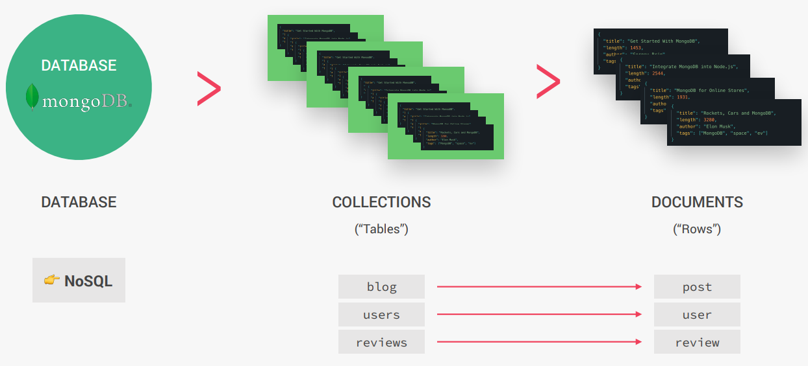

# MongoDB
MongoDB is a document database with the scalability and flexibility that you want with the querying and indexing that you need.



## Key Features
- **Document based**: MongoDB stores data in documents (field-value pair data structures, NoSQL).
- **Scalable**: Very easy to distribute data across multiple machines as your users and amount of data grows.
- **Flexible**: No document data schema required, so each document can have different number and type of fields.
- **Performant**: Embedded data models, indexing, sharding, flexible documents, native duplication, etc.
- Free and open-source, published under the SSPL License

## Documents, BSON and Embedding
### BSON
- **BSON** stands for **Binary JSON**. It is a binary-encoded serialization format used to store documents and make remote procedure calls in MongoDB.
- **BSON** is the data format MongoDB uses for data storage. It is like JSON, **but typed**. So MongoDB documents are typed.

#### Key Features of BSON:
1. **Efficient Storage**: Optimized for space and speed, making it ideal for database storage.
2. **Rich Data Types**: Supports additional data types not available in JSON, such as `Date`, `Binary`, and `ObjectId`.
3. **Traversable**: Designed to be lightweight and easy to traverse for fast data access.

### Document Structure


### Relational Database Structure


### Embedding/Denormalizing
- **Embedding/Denormalizing** refers to the practice of including related data directly within a single document in MongoDB. 
- This approach is different from the normalized structure used in relational databases, where related data is stored in separate tables and joined using relationships.

#### Key Features of Embedding:
1. **Quicker Access**: Since all related data is stored in a single document, there is no need for joins, making data retrieval faster.
2. **Simpler Data Model**: Embedding simplifies the data structure by keeping related information together.
3. **Ideal for One-to-Few Relationships**: Works well when the related data is small and unlikely to grow significantly.

#### Example
```json
{
  "userId": 1,
  "name": "John Doe",
  "orders": [
    { "orderId": 101, "product": "Laptop", "price": 1200 },
    { "orderId": 102, "product": "Mouse", "price": 25 }
  ]
}
```
In this example, the `orders` array is embedded within the `user` document.


#### When to Use Embedding:
- When related data is frequently accessed together.
- When the related data is small and does not grow significantly over time.

#### When Not to Use Embedding:
- When the related data is large or unbounded (e.g., a user with thousands of orders).
- When the related data is shared across multiple documents (e.g., product details shared by multiple orders).

Embedding is a powerful feature of MongoDB, but it should be used judiciously based on the application's requirements. 

### What is a Document in MongoDB?

In MongoDB, a **document** is the basic unit of data. It is a record in a collection, similar to a row in a table in SQL databases. However, unlike rows in SQL, documents in MongoDB are stored in a flexible, JSON-like format called **BSON** (Binary JSON).

### Comparison Between MongoDB Documents and SQL Rows:

| **Feature**            | **MongoDB Document**                          | **SQL Row**                     |
|-------------------------|-----------------------------------------------|----------------------------------|
| **Structure**           | JSON-like (key-value pairs)                  | Fixed schema (columns)          |
| **Schema**              | Flexible (schema-less)                       | Strict (predefined schema)      |
| **Storage**             | Stored in collections                        | Stored in tables                |
| **Data Types**          | Supports rich types (e.g., arrays, objects)  | Limited to column data types    |
| **Relationships**       | Embedded or referenced                       | Joins between tables            |

---

### Example:

#### MongoDB Document:
```json
{
  "userId": 1,
  "name": "John Doe",
  "email": "john.doe@example.com",
  "orders": [
    { "orderId": 101, "product": "Laptop", "price": 1200 },
    { "orderId": 102, "product": "Mouse", "price": 25 }
  ]
}
```
- Stored in a **collection**.
- Flexible: The `orders` field is an array of objects, which is not possible in SQL rows.

### SQL Row Example

| **userId** | **name**    | **email**               | **orderId** | **product** | **price** |
|------------|-------------|-------------------------|-------------|-------------|-----------|
| 1          | John Doe    | john.doe@example.com    | 101         | Laptop      | 1200      |
| 1          | John Doe    | john.doe@example.com    | 102         | Mouse       | 25        |


### Key Differences Between MongoDB Documents and SQL Rows

1. **Schema Flexibility**:
   - **MongoDB**: Documents can have different fields and structures within the same collection.
   - **SQL**: Rows must conform to the table's predefined schema.

2. **Embedded Data**:
   - **MongoDB**: Allows embedding related data (e.g., the `orders` array in the document).
   - **SQL**: Requires separate tables and joins for related data.

3. **Ease of Use**:
   - **MongoDB**: The document model is more natural for hierarchical or nested data.
   - **SQL**: Better suited for highly relational data with strict schemas.

MongoDB documents provide a more flexible and scalable way to store and query data, especially for modern applications with dynamic or hierarchical data structures.

## MongoDB Database Operations

- The command `show dbs` is used to display all databases.

- The `use <database_name>` command in MongoDB is used to switch to a specific database. If the database with the specified name does not exist, MongoDB will create it when you first insert data into it.

- The command `show collections` is used to display all collections in the current database.

- The command `db.collection.insertMany()` method in MongoDB is used to insert multiple documents (enclosed within an array) into the specified collection in a single operation. This function accepts a Javascript object like syntax where for key, the double quote is optional but the value should be enclosed within double quotes. 
  ### Example:
  ```javascript
  db.tours.insertMany([
    { name: "Tour A", price: 100 },
    { name: "Tour B", price: 200, description: "Show your luck"}
  ]);
  ```

- The command `db.collection.insertOne()` method in MongoDB is used to insert a single document into the specified collection in a single operation.
  ### Example:
  ```javascript
  db.tours.insertOne(
    { name: "Tour A", price: 100 },
  );
  ```

### Querying (Reading) Documents in MongoDB

The `db.collection.find()` command is used to query and retrieve documents from a MongoDB collection. It allows you to filter documents based on specific criteria.

#### Syntax:
```javascript
db.collection.find(query, projection)
```
- `query`: Specifies the filter criteria to match documents. If omitted, all documents are returned.
- `projection`: Specifies which fields to include or exclude in the result. If omitted, all fields are returned.

#### Examples

1. **Retrieve all documents:**
    ```javascript
      db.tours.find()
    ```
    - Returns all documents in the `tours` collection.
2. **Filter Documents:**
    ```javascript
    db.tours.find({ price: 100 })
    ```
    - Returns all documents where the `price` field is `100`.
3. **Projection (Include Specific Fields)**:
    ```javascript
    db.tours.find({ price: 100 }, { name: 1, price: 1, _id: 0 })
    ```
    - Returns only the `name` and `price` fields for documents where `price` is 100. Excludes the `_id` field.
4. **Filter with Multiple Conditions**:
    ```javascript
    db.tours.find({ price: { $gte: 100 }, rating: { $gt: 4.5 } })
    ```
    - Returns documents where `price` is greater than or equal to `100` and `rating` is greater than `4.5`.
5. **Filter with Logical Operators**:
    ```javascript
    db.tours.find({ $or: [{ price: 100 }, { rating: 5 }] })
    ```
    - Returns documents where `price` is `100` or `rating` is `5`.

6. **Filter with Nested Fields**:
    ```javascript
    db.users.find({ "address.city": "New York" })
    ```
    - Returns documents where the `city` field inside the `address` object is `"New York"`.

7. **Shorthand for `findOne`**:
    ```javascript
    // Tour.findOne({ _id: req.params.id });
    Tour.findById(req.params.id);
    ```

### Common Query Operators
- `$eq`: Matches values equal to a specified value.
- `$ne`: Matches values not equal to a specified value.
- `$gt`: Matches values greater than a specified value.
- `$gte`: Matches values greater than or equal to a specified value.
- `$lt`: Matches values less than a specified value.
- `$lte`: Matches values less than or equal to a specified value.
- `$in`: Matches any of the values specified in an array.
- `$or`: Matches documents that satisfy at least one of the conditions.

### Updating Documents in MongoDB

MongoDB provides several methods to update documents in a collection. These methods allow you to modify existing documents based on specific criteria.

1. **`db.collection.updateOne()`**  
    - Updates a single document that matches the filter criteria.
    - Example:
      ```javascript
      db.tours.updateOne(
        { name: "Tour A" }, // Filter
        { $set: { price: 150 } } // Update
      );
      ```
      - Updates the `price` field of the first document where `name` is `"Tour A"`.

2. **`db.collection.updateMany()`**  
    - Updates all documents that match the filter criteria.
    - Example:
      ```javascript
      db.tours.updateMany(
        { price: { $lt: 100 } }, // Filter
        { $set: { discount: true } } // Update
      );
      ```
      - Adds a `discount` field with the value `true` to all documents where `price` is less than `100`.

3. **`db.collection.replaceOne()`**  
    - Replaces an entire document with a new one.
    - Example:
      ```javascript
      db.tours.replaceOne(
        { name: "Tour A" }, // Filter
        { name: "Tour A", price: 200, description: "Updated Tour" } // New Document
      );
      ```
      - Replaces the document where `name` is `"Tour A"` with the new document.

---

#### Update Operators:
- **`$set`**: Sets the value of a field.
  ```javascript
  { $set: { field: value } }
  ```
- **`$unset`**: Removes a field from a document.
  ```javascript
  { $unset: { field: "" } }
  ```
- **$inc**: Increments the value of a field by a specified amount.
  ```javascript
  { $inc: { field: 1 } }
  ```
- **$push**: Adds an element to an array.
  ```javascript
  { $push: { arrayField: value } }
  ```

- **$pull**: Removes an element from an array.
  ```javascript
  { $pull: { arrayField: value } }
  ```

### Deleting Documents in MongoDB

MongoDB provides methods to delete documents from a collection based on specific criteria.

#### Common Delete Methods:
1. **`db.collection.deleteOne()`**  
    - Deletes the first document that matches the filter criteria.
    - Example:
      ```javascript
      db.tours.deleteOne({ name: "Tour A" });
      ```
      - Deletes the first document where `name` is `"Tour A"`.

2. **`db.collection.deleteMany()`**  
    - Deletes all documents that match the filter criteria.
    - Example:
      ```javascript
      db.tours.deleteMany({ price: { $lt: 100 } });
      ```
      - Deletes all documents where `price` is less than `100`.

3. **`db.collection.remove()`** *(Deprecated)*  
   - Previously used to delete documents but is now replaced by `deleteOne` and `deleteMany`.

#### Example:
```javascript
// Delete a single document
db.users.deleteOne({ age: { $gt: 30 } });

// Delete multiple documents
db.users.deleteMany({ status: "inactive" });
```

#### Notes:
- If no filter is provided, all documents in the collection will be deleted. Use this carefully.
  ```javascript
  db.tours.deleteMany({});
  ```
  - Deletes all documents in the `tours` collection.
- Deleting documents does not delete the collection itself. To drop the entire collection, use:
  ```javascript
  db.collection.drop();
  ```
