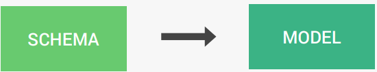
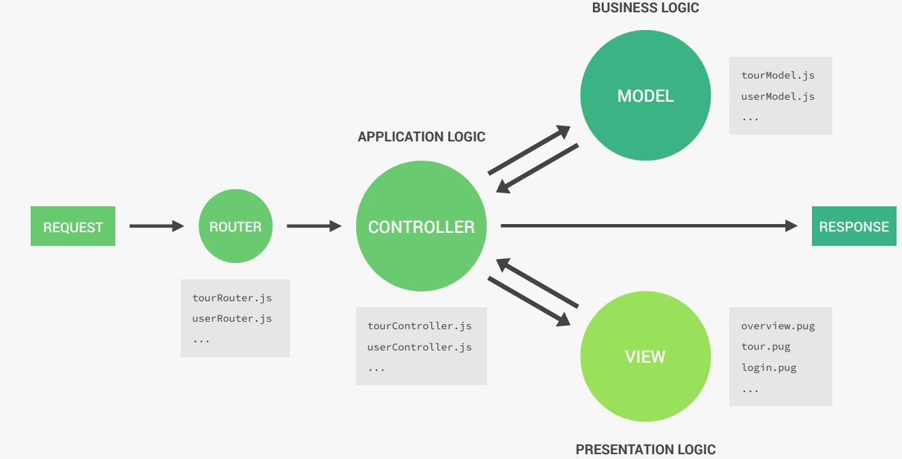
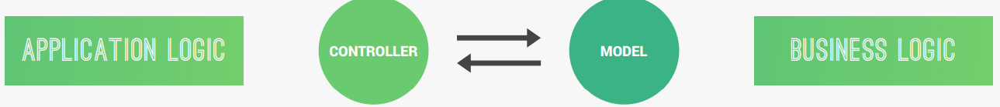

# Using MongoDB with Mongoose

## Mongoose
- Mongoose is an Object Data Modeling (ODM) library for MongoDB and Node.js, a higher level of abstraction.
- Mongoose allows for rapid and simple development of mongoDB database interactions.
- **Features**: Schemas to model data and relationships, easy data validation, simple query API, middleware etc.
- **Mongoose Schema**: Where we model our data, by describing the structure of the data, default values, and validation.
- **Mongoose Model**: A wrapper for the schema, providing an interface to the database for CRUD operations.



## Introduction to Back-End Architecture
### MVC (Model-View-Controller) Architecture

- **Model**: Represents the data and business logic of the application. It interacts with the database and defines how data is structured.
- **View**: Handles the presentation layer. It is responsible for displaying data to the user and capturing user input.
- **Controller**: Acts as an intermediary between the Model and the View. It processes user input, interacts with the Model, and updates the View accordingly.

This architecture promotes separation of concerns, making the application easier to maintain and scale.



### Application vs. Business Logic
#### Application Logic
- Code that is only concerned about the application’s implementation, not the underlying business problem we’re trying to solve (e.g. showing and selling tours);
- Concerned about managing requests and responses;
- About the app’s more technical aspects;
- Bridge between model and view layers.

#### Business Logic
Code that actually solves the business problem we set
out to solve;
- Directly related to business rules, how the business
works, and business needs;
- Examples:
  - Creating new tours in the database;
  - Checking if user’s password is correct;
  - Validating user input data;
  - Ensuring only users who bought a tour can review it.



**Note**: **Fat models/thin controllers**: Offload as much logic as possible into the models, and keep the controllers as simple and lean as possible.

## `process.argv` in Node.js

- `process.argv` is an array in Node.js that contains the command-line arguments passed when the Node.js process was launched.
- The first element is the path to the Node.js executable.
- The second element is the path to the JavaScript file being executed.
- Subsequent elements are the additional command-line arguments provided by the user.

**Example**:
```javascript
// Run: node app.js arg1 arg2
console.log(process.argv);
// Output: [ '/path/to/node', '/path/to/app.js', 'arg1', 'arg2' ]
```

## `req.query` and `req.params` in Express.js

- **`req.query`**:
  - Contains the query string parameters sent in the URL after the `?`.
  - Used for optional parameters or filters.
  - Example: For the URL `/tours?sort=price`, `req.query` will be `{ sort: 'price' }`.

- **`req.params`**:
  - Contains route parameters defined in the URL path.
  - Used for mandatory parameters.
  - Example: For the route `/tours/:id` and URL `/tours/123`, `req.params` will be `{ id: '123' }`.

Both are used to extract data from the request URL for processing.

## Virtual Properties in Mongoose
- Virtual properties are fields that are not stored in the database but are computed dynamically.
- They are defined in the schema and can be used to derive values based on existing fields.
- Example:
  ```javascript
  tourSchema.virtual('durationWeeks').get(function () {
    return this.duration / 7;
  });
  ```
- Useful for calculations or formatting data without persisting it in the database.

- In Mongoose, the options `{ toJSON: { virtuals: true }, toObject: { virtuals: true } }` are used to ensure that virtual properties are included when a document is converted to JSON or a plain JavaScript object.

### Why is this used?
1. Virtual Properties:
    - Virtual properties are fields that are not stored in the database but are computed dynamically (e.g., `durationWeeks` in your schema).
    - By default, virtual properties are not included when a document is converted to JSON or an object using `.toJSON()` or `.toObject()`.
2. Purpose:
    - Adding `{ virtuals: true }` ensures that virtual properties are included in the output when the document is serialized or converted to an object.

#### Example:
```javascript
const tour = await Tour.findById('12345');
console.log(tour.toJSON());
```
Without `{ virtuals: true }`: The `durationWeeks` virtual property will not appear in the output.
With `{ virtuals: true }`: The `durationWeeks` virtual property will be included in the output.

This is particularly useful when you want to expose computed fields (like `durationWeeks`) in API responses or other serialized outputs.

## Sorting in Mongoose
- Sorting is used to order query results based on one or more fields.
- The `.sort()` method is used, where fields are specified as strings:
    - Prefix with - for descending order.
    - Without - for ascending order.
- Example:
```javascript
Tour.find().sort('-price duration');
```
- This sorts tours by price in descending order and by duration in ascending order.

## Aggregation Pipelines in Mongoose
- Aggregation pipelines are powerful tools for data processing and transformation in MongoDB.
- They consist of stages (e.g., $match, $group, $sort) that process documents step by step.
- Example:
```javascript
Tour.aggregate([
  { $match: { ratingsAverage: { $gte: 4.5 } } },
  { $group: { _id: '$difficulty', avgPrice: { $avg: '$price' } } },
  { $sort: { avgPrice: 1 } }
]);
```
- Useful for complex queries like filtering, grouping, and calculating aggregate values.

## Middleware in Mongoose
- Middleware in Mongoose is a function that is executed during specific stages of the lifecycle of a Mongoose model. It is used to perform actions like validation, logging, or modifying data before or after certain operations.
- This is also known as `hooks`.

#### Types of Middleware:
1. **Document Middleware**:
    - Runs before (`pre`) or after (`post`) a document is saved, validated, or removed.
    - In **document middleware**, `this` refers to the document being processed.
    - Example: `save`, `validate`, `remove`.
    - Example:
      ```javascript
      tourSchema.pre('save', function (next) {
        this.slug = this.name.toLowerCase().replace(/ /g, '-');
        next();
      });
      ```

2. **Query Middleware**:
    - Runs before (`pre`) or after (`post`) a query is executed.
    - In **query middleware**, `this` refers to the query object.
    - Example: `find`, `findOne`, `findOneAndUpdate`.
    - Example:
      ```javascript
      tourSchema.pre(/^find/, function (next) {
        this.find({ secretTour: { $ne: true } });
        next();
      });
      ```

3. **Aggregate Middleware**:
    - Runs before (`pre`) or after (`post`) an aggregation pipeline is executed.
    - In **aggregation middleware**, `this` refers to the aggregation object.
    - Example:
      ```javascript
      tourSchema.pre('aggregate', function (next) {
        this.pipeline().unshift({ $match: { secretTour: { $ne: true } } });
        next();
      });
      ```

4. **Model Middleware**:
   - Runs before or after model-level operations like `insertMany`.
   - It's not much important.

Middleware is a powerful feature in Mongoose that helps in automating tasks and maintaining clean, reusable code.

## Data Validation in Mongoose
Mongoose provides built-in and custom validation mechanisms to ensure that the data stored in the database adheres to specific rules.

### 1. **Built-in Validators**
Mongoose offers several built-in validators for schema types:
- **`required`**: Ensures the field is not empty.
- **`min` and `max`**: For numbers, ensures the value is within a range.
- **`maxlength` and `minlength`**: For strings, ensures the length is within a range.
- **`match`**: For strings, ensures the value matches a regular expression.
- **`enum`**: Ensures the value is one of a predefined set of values.

**Example**:
```javascript
const tourSchema = new mongoose.Schema({
  name: {
    type: String,
    required: [true, 'A tour must have a name'], // Required validator with custom error message
    unique: true,
    trim: true,
    maxlength: [40, 'A tour name must have less than or equal to 40 characters'],
    minlength: [10, 'A tour name must have more than or equal to 10 characters'],
  },
  price: {
    type: Number,
    required: [true, 'A tour must have a price'],
    min: [0, 'Price must be above 0'],
  },
  difficulty: {
    type: String,
    required: [true, 'A tour must have a difficulty'],
    enum: {
      values: ['easy', 'medium', 'difficult'],
      message: 'Difficulty must be either: easy, medium, or difficult',
    },
  },
});
```
### 2. Custom Validators
You can define custom validation logic using the `validate` property.

**Example**:
```javascript
const tourSchema = new mongoose.Schema({
  priceDiscount: {
    type: Number,
    validate: {
      validator: function (val) {
        // `this` refers to the current document only on `save` or `create`
        return val < this.price; // Discount must be less than the price
      },
      message: 'Discount price ({VALUE}) should be below the regular price',
    },
  },
});
```

### 3. Validation on Update
By default, Mongoose validators only run on `save()` or `create()`. To enable validation on updates, use the `runValidators` option:
```javascript
Tour.findByIdAndUpdate(id, { price: -10 }, { runValidators: true });

// Enable validation on update by using the `runValidators` option
Tour.findByIdAndUpdate(
  '12345', // ID of the document to update
  { price: 500 }, // Update operation
  { 
    new: true, // Return the updated document
    runValidators: true // Enable validation
  }
)
  .then(updatedTour => console.log(updatedTour))
  .catch(err => console.error(err));
```

Mongoose validation ensures data integrity by enforcing rules at the schema level. You can use built-in validators for common cases and custom validators for more complex logic. 

### Instance Methods in Mongoose

An **instance method** in Mongoose is a method that is defined on a schema and is available on all documents created from that schema. These methods allow you to add custom functionality to your documents.

#### Example:
```javascript
// Instance method to check if the provided password matches the stored password
userSchema.methods.isCorrectPassword = async function (candidatePassword, userPassword) {
  return await bcrypt.compare(candidatePassword, userPassword);
};
```

#### Explanation:
1. `userSchema.methods`:
    - The `methods` property of a Mongoose schema is used to define instance methods.
    - These methods are available on all documents created from the schema.
2. **`isCorrectPassword` Method**:
    - This method compares the `candidatePassword` (provided by the user) with the `userPassword` (stored in the database).
    - It uses `bcrypt.compare()` to perform the comparison and returns a boolean indicating whether the passwords match.
3. **Usage**:
    - Once a document is created or queried, you can call the instance method on it:

```javascript
const user = await User.findOne({ email: 'example@example.com' });
const isCorrect = await user.isCorrectPassword('inputPassword', user.password);
console.log(isCorrect); // true or false
```

#### Key Points:
1. **Context (`this`)**:
    - Inside an instance method, this refers to the specific document on which the method is called.
2. **Use Cases**:
    - Instance methods are commonly used for tasks like:
      - Password validation
      - Generating authentication tokens
      - Custom document-specific logic
3. **Difference from Static Methods**:
    - Instance methods operate on individual documents.
    - Static methods operate on the model itself (e.g., `User.find()`).

#### Benefits:
- Encapsulates document-specific logic within the schema.
- Keeps the code clean and reusable.
- Provides a natural way to interact with documents in Mongoose.

Instance methods are a powerful feature of Mongoose that allow you to extend the functionality of your documents.
