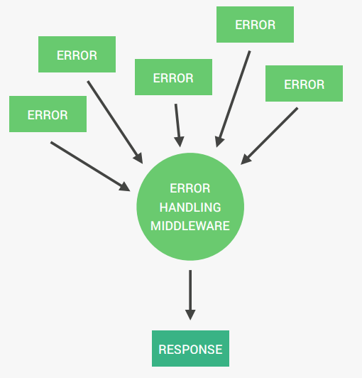

# Error Handling with Express

## Operational Errors
Problems that we can predict will happen at some point, so we just need to handle them in advance.
- Invalid path accessed
- Invalid user input (validate error from mongoose)
- Failed to connect to server
- Failed to connect to database
- Request timeout
- Etc.

## Programming Errors
Bugs that we developers introduce into our code. Difficult to find and handle.
- Reading properties on `undefined`
- Passing a number where an object is expected
- Using `await` without `async`
- Using `req.query` instead of `req.body`
- Etc.



## Error Handling Middleware in Express

- Error handling middleware in Express is a special type of middleware that is used to handle errors in the application. 
- It is defined with four parameters: `(err, req, res, next)`.

### Key Points:
1. **Error Object**: The `err` parameter contains details about the error, such as the status code and message.
2. **Order**: It should be defined **after all other middleware and routes** in the application. When you pass `next(err)` then it will skip all the middlewares in the middle and will directly go to the error handling middleware.
3. **Default Behavior**: If no error handling middleware is defined, Express will use its default error handler.

---

### Example from Code:
```javascript
// Error handling middleware
app.use((err, req, res, next) => {
  // If statusCode is not defined, set it to 500 (Internal Server Error)
  err.statusCode = err.statusCode || 500;

  // If status is not defined, set it to 'error'
  err.status = err.status || 'error';

  // Send the error response
  res.status(err.statusCode).json({
    status: err.status,
    message: err.message,
  });
});
```

### Explanation:
1. **Default Values**:
    - If the `err.statusCode` is not provided, it defaults to `500` (Internal Server Error).
    - If the `err.status` is not provided, it defaults to 'error'.
2. **Error Response**:
    - The middleware sends a JSON response with the `status` and `message` fields to the client.

### Usage:
This middleware will handle any errors passed to `next(err)` in the application. For example:
```javascript
app.get('/example', (req, res, next) => {
  const error = new Error('Something went wrong!');
  error.statusCode = 400;
  next(error); // Pass the error to the error handling middleware
});
```

The error handling middleware ensures that all errors are handled consistently across the application. 

### Purpose of `Error.captureStackTrace(this, this.constructor)`

The `Error.captureStackTrace()` method is used to create a stack trace for a custom error object. It is specific to the V8 JavaScript engine (used in Node.js and Chrome).

#### Explanation:
1. **`this`**: Refers to the current instance of the `AppError` class.
2. **`this.constructor`**: Refers to the constructor of the `AppError` class.

By calling `Error.captureStackTrace(this, this.constructor)`, the stack trace is captured starting from where the `AppError` instance is created, excluding the constructor itself. This ensures that the stack trace is clean and does not include internal implementation details.

### Key Benefits:
1. **Custom Stack Trace**:  
    It allows the stack trace to start from the point where the error is instantiated, making debugging easier.

2. **Operational Errors**:  
    Since `AppError` is designed for operational errors, this ensures that the stack trace is relevant and focused on the error's origin.

### Example:
```javascript
const error = new AppError('Invalid input', 400);
console.log(error.stack);
```
The `error.stack` will show the stack trace starting from where the `AppError` instance was created, excluding the `AppError` constructor.

This is particularly useful for custom error handling in applications, as it provides a clean and precise stack trace for debugging. 

### Catching Errors in Async Functions

```javascript
module.exports = (fn) => {
  return (req, res, next) => {
    fn(req, res, next).catch(next);
  };
};
```

#### Explanation of the Code

This code defines a utility function called `catchAsyncError` that is used to handle errors in asynchronous route handlers in Express. It ensures that any errors occurring in the asynchronous function are passed to the error-handling middleware using `next()`.

---

### How It Works:
1. **Input**:  
    The function takes an asynchronous function `fn` as an argument. This `fn` is typically a route handler or middleware.

2. **Return**:  
    It returns a new function that takes the standard Express parameters: `req`, `res`, and `next`.

3. **Error Handling**:  
    Inside the returned function, the asynchronous function `fn` is executed with `req`, `res`, and `next`.  
      - If `fn` resolves successfully, the request proceeds as normal.
      - If `fn` throws an error (or rejects a promise), the `.catch(next)` ensures that the error is passed to the next middleware, which is typically the error-handling middleware.

---

### Purpose:
This utility is used to avoid repetitive `try-catch` blocks in asynchronous route handlers.

---

### Example Usage:
#### Without `catchAsyncError`:
```javascript
app.get('/example', async (req, res, next) => {
  try {
    const data = await someAsyncFunction();
    res.status(200).json(data);
  } catch (err) {
    next(err); // Manually pass the error to the error-handling middleware
  }
});
```

#### With `catchAsyncError`:
```javascript
const catchAsyncError = require('./utils/catchAsyncError');

app.get(
  '/example',
  catchAsyncError(async (req, res, next) => {
    const data = await someAsyncFunction();
    res.status(200).json(data);
  })
);
```

### Benefits:
1. **Cleaner Code**:
Eliminates the need for repetitive try-catch blocks in every asynchronous route handler.

2. **Centralized Error Handling**:
Ensures that all errors are passed to the error-handling middleware consistently.

3. **Improved Readability**:
Makes route handlers more concise and easier to read.

### What is an Unhandled Promise Rejection in Node.js?

An **unhandled promise rejection** occurs when a `Promise` is rejected, but no `.catch()` handler or equivalent error-handling mechanism is provided to handle the rejection.


#### Example of Unhandled Promise Rejection:
```javascript
const someAsyncFunction = () => {
  return new Promise((resolve, reject) => {
    reject('Something went wrong!');
  });
};

// No .catch() to handle the rejection
someAsyncFunction();
```

In this example, the promise is rejected, but there is no `.catch()` or error-handling mechanism to handle the rejection. This will result in an **unhandled promise rejection**.

### Why is it a Problem?
1. **Application Crash**:
In Node.js, unhandled promise rejections can cause the application to crash in future versions of Node.js.

2. **Debugging Issues**:
Without proper error handling, it becomes difficult to debug and identify the source of the error.

3. **Unpredictable Behavior**:
Unhandled rejections can lead to inconsistent application behavior.

### How to Handle Promise Rejections:
1. **Using `.catch()`**: Always attach a `.catch()` handler to promises to handle rejections.

```javascript
someAsyncFunction()
  .then((result) => console.log(result))
  .catch((err) => console.error(err));
```
2. **Using `try-catch` and `async-await`**: Wrap `await` calls in a `try-catch` block to handle errors.
```javascript
const handleAsync = async () => {
  try {
    const result = await someAsyncFunction();
    console.log(result);
  } catch (err) {
    console.error(err);
  }
};

handleAsync();
```
3. **Global Event Listener**: Use the `process.on('unhandledRejection')` event to catch unhandled promise rejections globally.
```javascript
process.on('unhandledRejection', (reason, promise) => {
  console.error('Unhandled Rejection at:', promise, 'reason:', reason);
  // Optionally exit the process
  process.exit(1);
});
```

### Best Practices
- Always handle promise rejections using `.catch()` or `try-catch`.
- Use a global handler `(process.on('unhandledRejection'))` as a fallback to log and handle unexpected rejections.
- Ensure proper error handling in all asynchronous code to avoid unhandled rejections.

By handling promise rejections properly, you can ensure your Node.js application is more robust and less prone to crashes. 

### What are Uncaught Exceptions in Node.js?

An **uncaught exception** occurs when an error is thrown in a Node.js application and is not caught or handled by any `try-catch` block or error-handling mechanism.

#### Example of an Uncaught Exception:
```javascript
// This will throw an error, but there is no try-catch to handle it
throw new Error('This is an uncaught exception!');
```

In this example, the application will crash because the error is not handled.

#### Why are Uncaught Exceptions a Problem?
1. **Application Crash**:
Uncaught exceptions will cause the Node.js process to terminate immediately.

2. **Unpredictable Stat**e:
The application may be left in an inconsistent or unpredictable state.

3. **Poor User Experience**:
Crashing the application without proper error handling can lead to a bad user experience.

### Handling Uncaught Exceptions:
Node.js provides a global event listener to handle uncaught exceptions.

#### Example:
```javascript
global.process.on('uncaughtException', (err) => {
  console.error('Uncaught Exception! Shutting down...');
  console.error(err.name, err.message);

  // Optionally shut down the server gracefully
  process.exit(1); // Exit the process with a failure code
});
```

#### Usage in Your Code:
In the provided code, you can add an uncaughtException handler at the top of your application:
```javascript
global.process.on('uncaughtException', (err) => {
  console.log('Uncaught Exception! Shutting down...');
  console.log(err.name, err.message);
  process.exit(1);
});
```

#### Best Practices:
1. **Always Handle Errors**:
Use `try-catch` blocks or proper error-handling middleware to catch errors.

2. **Graceful Shutdown**:
When an uncaught exception occurs, log the error and shut down the application gracefully.

3. **Avoid Unhandled Errors**:
Write robust code to prevent uncaught exceptions from occurring in the first place.

4. **Use Tools**:
Use tools like `process.on('uncaughtException')` and `process.on('unhandledRejection')` as a fallback for unexpected errors.

This ensures that your application logs the error and exits gracefully when an uncaught exception occurs.

### `.catch` function with `next` middleware
The following two lines produces the same result because the `.catch()` method in JavaScript can directly accept a function reference `(next)` as its argument, which is equivalent to passing an inline function like `(err) => next(err)`.
```javascript
fn(req, res, next).catch((err) => next(err));
fn(req, res, next).catch(next);
```

#### Explanation
##### 1. First line
```javascript
fn(req, res, next).catch((err) => next(err));
```
- Here, `.catch()` takes an inline function `(err) => next(err)`.
- When the promise returned by `fn(req, res, next)` is rejected, the `err` is passed to the arrow function, which then calls `next(err)` to pass the error to the next middleware.

##### 2. Second Line
```javascript
fn(req, res, next).catch(next);
```
- Here, `.catch()` directly takes the `next` function as its argument.
- When the promise is rejected, the `.catch()` automatically calls `next(err)` with the error, as `next` is designed to accept an error as its first argument. 

#### Why are they equivalent
The `.catch()` method in JavaScript works by passing the rejection reason (error) to the function provided as its argument. Since `next` is already a function that takes an error as its argument `(next(err))`, there is no need to wrap it in another function like `(err) => next(err)`.

#### Simplification
The second line is a shorthand for the first line. It is more concise and achieves the same result because `next` is already compatible with the `.catch()` method's behavior.

#### Best Practice
Use the second line `(fn(req, res, next).catch(next))` for simplicity and readability, as it avoids unnecessary wrapping of the next function.
