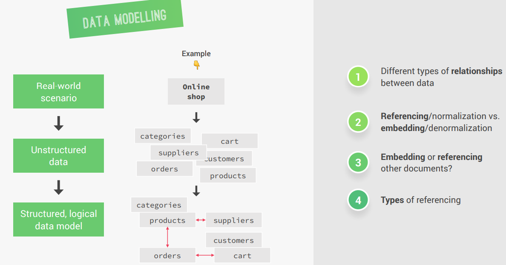
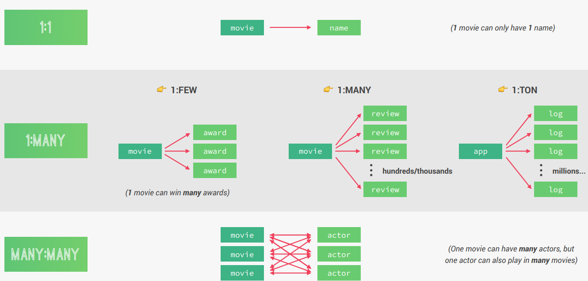
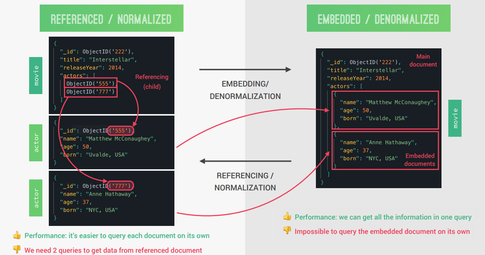
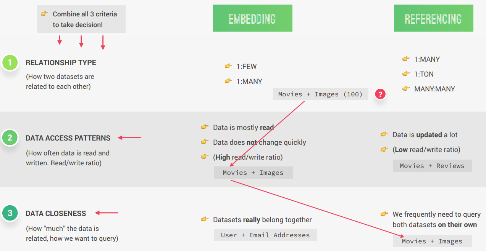
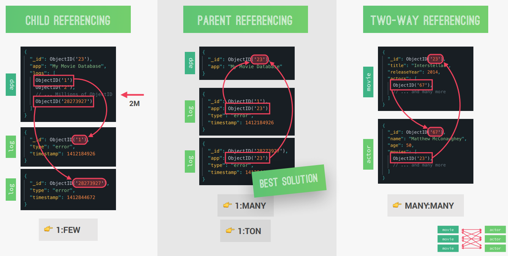
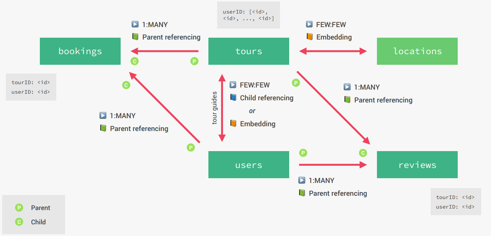

# Modelling Data and Advanced Mongoose

## Data Modelling
- **Data modeling** in Mongoose refers to the process of defining the structure, schema, and relationships of data stored in a MongoDB database. 
- It involves creating **schemas** that act as blueprints for documents in a collection.

### Key Features of Data Modeling in Mongoose:
1. **Schema Definition**:
    - Mongoose schemas define the structure of documents, including fields, data types, and validation rules.
    - **Example**:
      ```javascript
      const userSchema = new mongoose.Schema({
        name: { 
          type: String, 
          required: true 
        },
        email: { 
          type: String, 
          required: true, 
          unique: true 
        },
        age: { 
          type: Number, 
          min: 0 
        },
      });
      ```

2. **Relationships**:
    - Mongoose allows modeling relationships between collections, such as **embedding** (nested documents) or **referencing** (using **ObjectIds**).

3. **Validation**:
    - Schemas include built-in and custom validation to ensure data integrity.

4. **Middleware**:
    - Mongoose provides **pre** and **post-hooks** (middleware) for handling logic during document lifecycle events (e.g., saving, updating).

### Benefits of Data Modeling:
- Ensures consistency and structure in the database.
- Simplifies querying and data manipulation.
- Supports advanced features like validation, indexing, and middleware.



Data modeling in Mongoose is essential for building robust and scalable applications with MongoDB.

### Type of Relationships between Data in MongoDB

- In MongoDB, relationships between data can be modeled in two primary ways: 
  - **Embedding**
  - **Referencing**
- The choice depends on the nature of the relationship and how the data will be queried and updated.

### 1. **Embedding (Denormalization)**:
- Related data is stored as a **nested document** within the parent document.
- Suitable for **1:1** and **1:Few** relationships where the related data is tightly coupled.

#### Example:
```json
{
  "userId": 1,
  "name": "John Doe",
  "orders": [
    { "orderId": 101, "product": "Laptop", "price": 1200 },
    { "orderId": 102, "product": "Mouse", "price": 25 }
  ]
}
```

#### Advantages
- Faster reads as all related data is in a single document.
- Simpler queries since no joins are required.

#### Disadvantages
- Data duplication if the embedded data is shared across multiple documents.
- Updates can be expensive if the embedded data grows or changes frequently.

### 2. Referencing (Normalization)
- Related data is stored in **separate collections**, and references (e.g., `ObjectId`) are used to link them.
- Suitable for `1:Many` and `Many:Many` relationships where the related data is loosely coupled.

#### Example:
#### Users Collection:
```json
{
  "_id": 1,
  "name": "John Doe",
  "orders": [101, 102]
}
```

#### Orders Collection
```json
{
  "_id": 101,
  "product": "Laptop",
  "price": 1200
}
```

#### Advantages:
- Avoids data duplication, making updates easier.
- Suitable for large datasets or when related data is accessed independently.

#### Disadvantages:
- Slower reads as multiple queries or joins are required.
- More complex queries to fetch related data.

### 3. Hybrid Approach
- Combines embedding and referencing to balance performance and maintainability.
- Frequently accessed data is embedded, while less frequently accessed or large datasets are referenced.

#### Example
```json
{
  "userId": 1,
  "name": "John Doe",
  "orders": [
    { "orderId": 101, "product": "Laptop" },
    { "orderId": 102, "product": "Mouse" }
  ],
  "addressId": "605c72ef1f1b2c001f8e4d3a" // Referenced
}
```

### Choosing Between Embedding and Referencing

| **Criteria**         | **Embed**                     | **Reference**                  |
|-----------------------|-------------------------------|---------------------------------|
| **Relationship Type** | 1:1, 1:Few                   | 1:Many, Many:Many              |
| **Data Access**       | Accessed together frequently | Accessed independently          |
| **Data Size**         | Small                        | Large                           |
| **Update Frequency**  | Rarely updated               | Frequently updated              |
| **Data Duplication**  | Acceptable                   | Should be avoided               |

### Practical Framework:

#### **Embed**:
- When data is mostly read and rarely updated.
- When two datasets belong intrinsically together (e.g., user profile and settings).

#### **Reference**:
- When data is updated frequently.
- When datasets are large or need to be accessed independently.

#### **Hybrid**:
- Use embedding for frequently accessed fields and referencing for less frequently accessed or large datasets.

### Summary:
1. **1:1 and 1:Few**: Favor **embedding**.
2. **1:Many and Many:Many**: Favor **referencing**.
3. Use **hybrid** for a balance between performance and maintainability.



By structuring relationships based on your application's use cases, you can optimize performance and scalability in MongoDB.

### Referencing vs. Embedding



### When to Embed and When to Reference (A Practical Framework)


### Types of Referencing


### Summary
- The most important principle is: Structure your data to **match the ways that your application queries and updates data**.
- In other words: Identify the questions that arise from your **application’s use cases first**, and then model your data so that
the **questions can get answered** in the most efficient way.
- In general, **always favor embedding**, unless there is a good reason not to embed. Especially on `1:FEW` and `1:MANY`
relationships.
- A `1:TON` or a `MANY:MANY` relationship is usually a good reason to **reference** instead of embedding.
- Also, favor **referencing** when data is updated a lot and if you need to frequently access a dataset on its own.
- Use **embedding** when data is mostly read but rarely updated, and when two datasets belong intrinsically together.
- Don’t allow arrays to grow indefinitely. Therefore, if you need to normalize, use **child referencing** for `1:MANY` relationships, and **parent referencing** for `1:TON` relationships.
- Use **two-way referencing** for `MANY:MANY` relationships.

## The Natours Data Model


## GeoJSON
- **GeoJSON** is a format for encoding geographic data structures using JSON (JavaScript Object Notation). 
- It is widely used to represent geographical features and their properties in a structured and lightweight format.

### Key Features of GeoJSON:
1. **Geometric Objects**:
   - GeoJSON supports various geometric shapes, such as:
     - **Point**: Represents a single location (e.g., latitude and longitude).
     - **LineString**: Represents a series of connected points (e.g., a road or path).
     - **Polygon**: Represents an area enclosed by a boundary (e.g., a country or lake).
     - **MultiPoint**, **MultiLineString**, **MultiPolygon**: Represent collections of points, lines, or polygons.

2. **Feature and FeatureCollection**:
   - **Feature**: Combines a geometry with additional properties (e.g., metadata).
   - **FeatureCollection**: A collection of multiple features.

3. **Coordinate System**:
   - GeoJSON uses the WGS84 coordinate reference system (latitude and longitude).

### Example of GeoJSON:

#### Point:
```json
{
  "type": "Point",
  "coordinates": [102.0, 0.5]
}
```

#### LineString:
```json
{
  "type": "LineString",
  "coordinates": [
    [102.0, 0.0],
    [103.0, 1.0],
    [104.0, 0.0],
    [105.0, 1.0]
  ]
}
```

#### Polygon:
```json
{
  "type": "Polygon",
  "coordinates": [
    [
      [100.0, 0.0],
      [101.0, 0.0],
      [101.0, 1.0],
      [100.0, 1.0],
      [100.0, 0.0]
    ]
  ]
}
```

#### Feature:
```json
{
  "type": "Feature",
  "geometry": {
    "type": "Point",
    "coordinates": [102.0, 0.5]
  },
  "properties": {
    "name": "Sample Location"
  }
}
```

#### FeatureCollection:
```json
{
  "type": "FeatureCollection",
  "features": [
    {
      "type": "Feature",
      "geometry": {
        "type": "Point",
        "coordinates": [102.0, 0.5]
      },
      "properties": {
        "name": "Location A"
      }
    },
    {
      "type": "Feature",
      "geometry": {
        "type": "LineString",
        "coordinates": [
          [102.0, 0.0],
          [103.0, 1.0]
        ]
      },
      "properties": {
        "name": "Path A"
      }
    }
  ]
}
```

### Use Cases of GeoJSON:
1. **Mapping Applications**:
    - Used to represent locations, routes, and areas on maps.
2. **Geospatial Analysis**:
    - Used in GIS (Geographic Information Systems) for spatial data analysis.
3. **APIs**:
    - Commonly used in APIs to send and receive geospatial data.

### GeoJSON in MongoDB:
MongoDB supports GeoJSON for storing and querying geospatial data. For example:

- **Schema Definition**:
```javascript
const locationSchema = new mongoose.Schema({
  type: {
    type: String,
    enum: ['Point'],
    required: true
  },
  coordinates: {
    type: [Number],
    required: true
  }
});
```
- **Querying**: MongoDB provides geospatial queries like `$geoWithin`, `$near`, and `$geoIntersects` to work with GeoJSON data.

GeoJSON is a powerful and standardized format for working with geospatial data in modern applications.

## Nested Routes
**Nested routes** in web development refer to routes that are structured hierarchically to represent relationships between resources. In the context of RESTful APIs, nested routes are used when one resource is related to another, such as a parent-child relationship.

### Example Use Case:
Consider a scenario where you have two resources: **Tours** and **Reviews**. A tour can have multiple reviews, creating a parent-child relationship.

### Example of Nested Routes:

#### 1. **Standard Routes**:
Without nesting, you might define separate routes for tours and reviews:
```javascript
app.use('/api/v1/tours', tourRouter);
app.use('/api/v1/reviews', reviewRouter);
```

#### 2. Nested Routes:
To represent the relationship between tours and reviews, you can nest the review routes under the tour routes:
```javascript
app.use('/api/v1/tours/:tourId/reviews', reviewRouter);
```
Here, `:tourId` is a dynamic parameter representing the ID of the parent tour.a

#### Example in Express
```javascript
// Nested route for reviews under tours
const express = require('express');
const reviewRouter = require('./routes/reviewRoutes');

const app = express();

// Mount the nested route
app.use('/api/v1/tours/:tourId/reviews', reviewRouter);
```

In the `reviewRouter`, you can access the `tourId` parameter using `req.params.tourId`.

#### Benefits of Nested Routes:
1. **Clear Relationships**:
    - Makes it clear that reviews belong to a specific tour.
2. **Logical Structure**:
    - Organizes routes in a way that reflects the data hierarchy.
3. **Simplified Queries**:
    - Allows filtering reviews by their parent tour directly.

#### Example Request
To get all reviews for a specific tour:
```json
GET /api/v1/tours/12345/reviews
```

To create a review for a specific tour:
```json
POST /api/v1/tours/12345/reviews
```

Nested routes are a powerful way to represent relationships between resources in RESTful APIs.

## Indexing in MongoDB
- **Indexing** in MongoDB is a mechanism to improve the performance of queries by allowing the database to quickly locate and retrieve the requested data without scanning the entire collection.

### Key Features of Indexing:
1. **Improves Query Performance**:
    - Indexes make queries faster by reducing the amount of data MongoDB needs to scan.

2. **Supports Sorting**:
    - Indexes allow efficient sorting of query results.

3. **Unique Constraints**:
    - Indexes can enforce uniqueness on a field, ensuring no duplicate values.

4. **Compound Indexes**:
    - MongoDB supports indexes on multiple fields, enabling efficient queries on combinations of fields.

### Types of Indexes in MongoDB:
1. **Single Field Index**:
    - Indexes a single field in a collection.
    - Example:
      ```javascript
      db.collection.createIndex({ fieldName: 1 }); // Ascending order
      ```

2. **Compound Index**:
    - Indexes multiple fields in a collection.
    - Example:
      ```javascript
      db.collection.createIndex({ field1: 1, field2: -1 }); // Mixed order
      ```

3. **Text Index**:
    - Used for text search in string fields.
    - Example:
      ```javascript
      db.collection.createIndex({ fieldName: "text" });
      ```

4. **Geospatial Index**:
    - Used for querying geospatial data (e.g., locations).
    - Example:
      ```javascript
      db.collection.createIndex({ location: "2dsphere" });
      ```

5. **Hashed Index**:
    - Used for sharding and equality queries.
    - Example:
      ```javascript
      db.collection.createIndex({ fieldName: "hashed" });
      ```

#### Example of Index Creation:
```javascript
// Create an index on the "email" field
db.users.createIndex({ email: 1 });

// Create a compound index on "name" and "age"
db.users.createIndex({ name: 1, age: -1 });
```

#### Viewing Indexes:
To view all the indexes on a collection:
```javascript
db.collection.getIndexes()
```

#### Dropping an Index:
- To drop a specific index:
  ```javascript
  db.collection.dropIndex("indexName")
  ```
- To drop all indexes:
  ```javascript
  db.collection.dropIndexes()
  ```

### Benefits of Indexing:
1. **Faster Query Execution**:
    - Reduces query execution time by avoiding full collection scans.
2. **Efficient Sorting**:
    - Enables efficient sorting of query results.
3. **Enforces Constraints**:
    - Ensures data integrity with unique indexes.

### Trade-offs of Indexing:
1. **Increased Storage**:
    - Indexes consume additional disk space.
2. **Slower Write Operations**:
    - Insert, update, and delete operations may be slower due to index maintenance.
3. **Memory Usage**:
    - Indexes consume memory, which can impact performance if not managed properly.

### Best Practices:
1. **Index Frequently Queried Fields**:
    - Create indexes on fields that are commonly used in queries, filters, or sorting.
2. **Use Compound Indexes Wisely**:
    - Combine fields in a single index if they are frequently queried together.
3. **Monitor Index Usage**:
    - Use the explain() method to analyze query performance and ensure indexes are being used.
4. **Avoid Over-Indexing**:
    - Too many indexes can increase storage and slow down write operations.

### Example of Query Optimization with Indexes:
- Without an index:
```javascript
db.users.find({ email: "example@example.com" });
```
MongoDB performs a full collection scan.

- With an index:
```javascript
db.users.createIndex({ email: 1 });
db.users.find({ email: "example@example.com" });
```
MongoDB uses the index to quickly locate the document.

Indexes are a powerful tool in MongoDB for optimizing query performance and ensuring efficient data retrieval.

## API Documentation
- Generated using Postbot (Postman)
- [API Documentation](https://documenter.getpostman.com/view/15909882/2sB2j4frHL)
